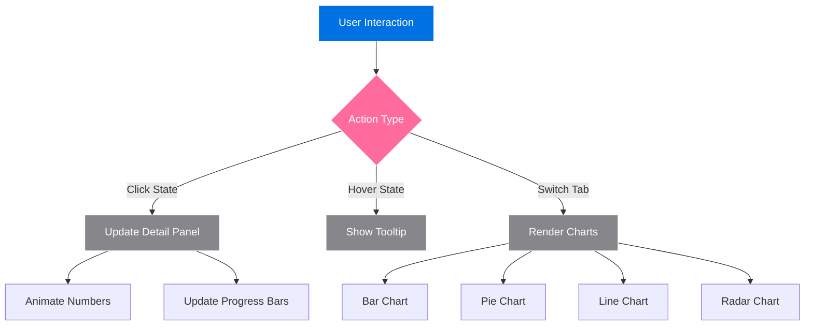
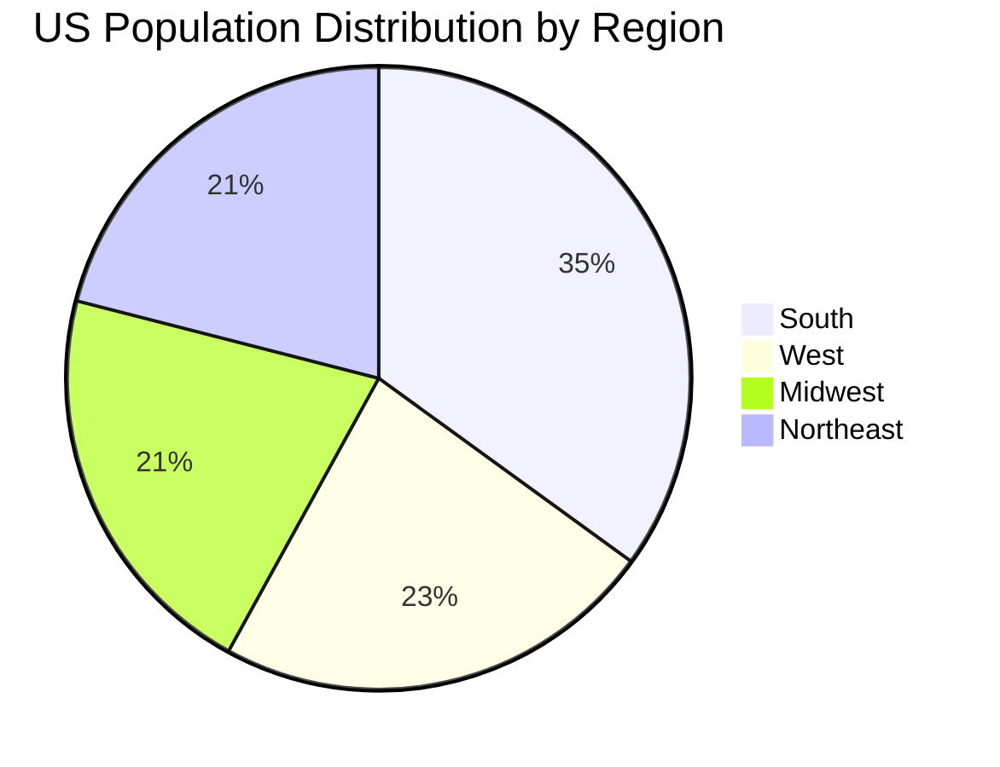

<div align="center">

<br>


<br>

<p align="center">
  
  
  
  
</p>

<p align="center">
  
  
  
  
</p>

<p align="center">
  
  
  
  
</p>

<br>

<h3>🍎 Experience Data Visualization Like Never Before</h3>

<p align="center">
  <b>An Apple-inspired interactive data visualization platform showcasing US birth & death statistics by state.</b>
  <br>
  <i>Crafted with precision, designed with elegance, powered by data.</i>
</p>

<br>

<p align="center">
  <a href="#-features">Features</a> •
  <a href="#-demo">Demo</a> •
  <a href="#-installation">Installation</a> •
  <a href="#-screenshots">Screenshots</a> •
  <a href="#-tech-stack">Tech Stack</a> •
  <a href="#-license">License</a>
</p>

<br>

---

<br>

</div>

## 📊 Project Overview

<table>
<tr>
<td width="50%">

### 🎯 What is this?

A stunning, single-page web application that visualizes US population data through an interactive map, multiple chart types, and comprehensive analysis reports. Built with Apple's design language in mind, featuring glassmorphism effects, smooth animations, and SF Pro typography.

</td>
<td width="50%">

### 💡 Why use it?

Perfect for data analysts, researchers, students, or anyone interested in US demographics. The Apple-style interface makes complex data accessible and beautiful. No backend required — just open and explore!

</td>
</tr>
</table>

<br>

<div align="center">

### 🎬 Live Demo

<br>


<br>

**🔗 Live Preview**: [us-population-insights.vercel.app](https://us-population-insights.vercel.app)

</div>

<br>

---

<br>

## ✨ Features

<div align="center">

<table>
<tr>
<td align="center" width="33%">

### 🗺️ Interactive Map


</td>
<td align="center" width="33%">

### 📊 Data Visualization


</td>
<td align="center" width="33%">

### 📋 Analysis Reports


</td>
</tr>
<tr>
<td>

- 🖱️ Click any state
- 🎨 Color-coded data
- 💬 Hover tooltips
- 📌 State selection
- 🔍 Zoom & pan ready

</td>
<td>

- 📊 Bar charts
- 🥧 Pie/Doughnut charts
- 📈 Line charts
- 🎯 Radar charts
- 🔄 Region comparison

</td>
<td>

- 📝 Executive summary
- 🗺️ Regional analysis
- 📈 Trend insights
- 💡 Recommendations
- 🖨️ Print-ready

</td>
</tr>
</table>

</div>

<br>

### 🎨 Design Excellence

<details>
<summary>📖 Click to expand design details</summary>

<br>

| Design Element | Implementation | Apple Reference |
|---------------|----------------|-----------------|
| **Color Palette** | `#0071E3` (Blue), `#FF6B9D` (Pink), `#1D1D1F` (Ink) | Apple System Colors |
| **Typography** | SF Pro Display, -apple-system, BlinkMacSystemFont | Apple Developer Fonts |
| **Glassmorphism** | `backdrop-filter: saturate(180%) blur(20px)` | macOS Big Sur+ Style |
| **Animations** | `cubic-bezier(0.4, 0, 0.2, 1)` easing | Apple Motion Guidelines |
| **Border Radius** | 16px - 24px (rounded-2xl, rounded-3xl) | Apple HIG |
| **Spacing** | Generous whitespace, 8px grid system | Apple Layout Principles |

<br>

```css
/* Apple-inspired Glassmorphism */
.glass-panel {
    background: rgba(255, 255, 255, 0.72);
    backdrop-filter: saturate(180%) blur(20px);
    -webkit-backdrop-filter: saturate(180%) blur(20px);
    border: 1px solid rgba(255, 255, 255, 0.18);
}

/* Apple-style Smooth Animations */
* {
    transition: all 0.4s cubic-bezier(0.4, 0, 0.2, 1);
}
```

</details>

<br>

---

<br>

## 📸 Screenshots

<div align="center">

### 🖼️ Application Preview

<br>

<table>
<tr>
<td align="center">

**🗺️ Map View**


*Interactive US map with state selection*

</td>
<td align="center">

**📊 Charts View**


*Multiple chart types for data analysis*

</td>
</tr>
<tr>
<td align="center">

**📋 Report View**


*Comprehensive analysis report*

</td>
<td align="center">

**📱 Mobile Responsive**


*Fully responsive on all devices*

</td>
</tr>
</table>

</div>

<br>

---

<br>

## 🛠️ Tech Stack

<div align="center">

<br>

<table>
<tr>
<td align="center" width="20%">


**HTML5**

Structure & Semantics

</td>
<td align="center" width="20%">


**Tailwind CSS**

Styling & Layout

</td>
<td align="center" width="20%">


**D3.js**

Interactive Map

</td>
<td align="center" width="20%">


**Chart.js**

Data Visualization

</td>
<td align="center" width="20%">


**Font Awesome**

Icons

</td>
</tr>
</table>

<br>

</div>

<details>
<summary>🔧 Technical Implementation Details</summary>

<br>



<br>

| Component | Technology | Purpose |
|-----------|------------|---------|
| **Map Rendering** | D3.js + TopoJSON | US state boundaries |
| **Chart Generation** | Chart.js | Bar, Pie, Line, Radar charts |
| **Styling** | Tailwind CSS + Custom CSS | Apple-style design system |
| **Interactions** | Vanilla JavaScript | Click, hover, tab switching |
| **Animations** | CSS Transitions + JS | Number counting, progress bars |
| **Responsive** | Tailwind Breakpoints | Mobile, tablet, desktop |

</details>

<br>

---

<br>

## 🚀 Installation & Usage

### 📦 Quick Start

<table>
<tr>
<td width="50%">

**Option 1: Direct Download** 📥

```bash
# Download index.html
wget https://raw.githubusercontent.com/yourusername/us-population-insights/main/index.html

# Open in browser
open index.html
```

</td>
<td width="50%">

**Option 2: Git Clone** 🔄

```bash
# Clone repository
git clone https://github.com/yourusername/us-population-insights.git

# Navigate to project
cd us-population-insights

# Open in browser
open index.html
```

</td>
</tr>
</table>

<br>

### 🏃 Run with Local Server

<details>
<summary>🔧 Advanced Setup Options</summary>

<br>

**Python Server:**

```bash
# Python 3
python -m http.server 8000

# Python 2
python -m SimpleHTTPServer 8000

# Visit http://localhost:8000
```

**Node.js Server:**

```bash
# Using http-server
npx http-server

# Using live-server
npx live-server
```

**VS Code:**

```bash
# Install Live Server extension
# Right-click index.html → "Open with Live Server"
```

</details>

<br>

### 📖 Usage Guide

<div align="center">

| View | What to Do | What You'll See |
|------|-----------|-----------------|
| 🗺️ **Map** | Click any state | Detailed birth/death statistics |
| 📊 **Charts** | Switch chart types | Bar, Pie, Line, Radar visualizations |
| 📋 **Report** | Read analysis | Executive summary & insights |
| 📱 **Mobile** | Resize browser | Fully responsive layout |

</div>

<br>

---

<br>

## 📊 Data & Statistics

<details>
<summary>📈 View Project Statistics</summary>

<br>

<div align="center">

| Metric | Value |
|--------|-------|
| **Total States Covered** | 50 + DC |
| **Total Births (2023)** | ~3,700,000 |
| **Total Deaths (2023)** | ~2,950,000 |
| **Natural Growth Rate** | ~20.3% |
| **Data Source** | CDC / NCHS |
| **Coverage** | 100% US States |
| **Update Frequency** | Annual |

</div>

<br>



</details>

<br>

---

<br>

## 🎯 Key Features Deep Dive

<details>
<summary>🗺️ Interactive Map Features</summary>

<br>

- **Real Geographic Data**: Uses TopoJSON for accurate US state boundaries
- **Smart Color Coding**: States colored by birth/death ratio
- **Glassmorphism Tooltips**: Beautiful hover information cards
- **State Selection**: Click to highlight and view details
- **Responsive Scaling**: Adapts to any screen size

```javascript
// Color interpolation for states
const colorScale = d3.scaleSequential()
    .domain([0, 500000])
    .interpolator(d3.interpolateRgb("#e8f0fe", "#0071e3"));
```

</details>

<details>
<summary>📊 Chart Features</summary>

<br>

| Chart Type | Use Case | Features |
|------------|----------|----------|
| **Bar Chart** | State comparison | Top 10 states, rounded corners |
| **Pie Chart** | Regional distribution | Doughnut style, hover effects |
| **Line Chart** | Trend analysis | 5-year data, smooth curves |
| **Radar Chart** | Multi-dimensional | Regional comparison, 6 metrics |

</details>

<details>
<summary>🎨 Design Features</summary>

<br>

- **Apple System Colors**: `#0071E3`, `#FF6B9D`, `#1D1D1F`
- **SF Pro Typography**: Native Apple font stack
- **Glassmorphism**: `backdrop-filter: blur(20px)`
- **Smooth Animations**: `cubic-bezier(0.4, 0, 0.2, 1)`
- **Micro-interactions**: Hover states, transitions
- **Number Animations**: Count-up effects on load

</details>

<br>

---

<br>

## 🌟 Highlights

<div align="center">

<br>

<table>
<tr>
<td>

### 🏆 Design Excellence

```
🎨 Apple-Inspired UI
✨ Glassmorphism Effects
🎯 Pixel-Perfect Layouts
💫 Smooth Animations
📱 Fully Responsive
```

</td>
<td>

### 🚀 Performance

```
⚡ Single File Application
📦 No Build Required
🔄 Real-time Updates
💾 Minimal Dependencies
🌐 CDN Powered
```

</td>
<td>

### 📊 Data Rich

```
🗺️ 50 States + DC
📈 4 Chart Types
📋 Comprehensive Reports
🔍 Interactive Elements
💡 Smart Insights
```

</td>
</tr>
</table>

</div>

<br>

---

<br>

## 🤝 Contributing

<div align="center">

We welcome contributions! Here's how you can help:

</div>


<br>

<details>
<summary>📝 Contribution Guidelines</summary>

<br>

1. **Fork** the repository
2. **Create** a feature branch (`git checkout -b feature/AmazingFeature`)
3. **Commit** your changes (`git commit -m 'Add AmazingFeature'`)
4. **Push** to the branch (`git push origin feature/AmazingFeature`)
5. **Open** a Pull Request

### 🐛 Bug Reports

- Use GitHub Issues
- Include browser & OS info
- Provide screenshots
- Describe expected vs actual behavior

### 💡 Feature Requests

- Check existing issues first
- Clearly describe the feature
- Explain the use case
- Provide mockups if possible

</details>

<br>

---

<br>

## 📋 Roadmap

<details>
<summary>🚀 Future Enhancements</summary>

<br>

- [ ] 🌍 Add county-level data
- [ ] 📅 Time series animations
- [ ] 🎨 Dark mode toggle
- [ ] 📤 Export data as CSV
- [ ] 🔍 Search functionality
- [ ] 📊 Additional chart types
- [ ] 🗺️ Zoom & pan controls
- [ ] 💾 Save favorite states
- [ ] 🔔 Data update notifications
- [ ] 🌐 Multi-language support

</details>

<br>

---

<br>

## 📄 License

<div align="center">

MIT License

Copyright © 2024 US Population Insights

Permission is hereby granted, free of charge, to any person obtaining a copy
of this software and associated documentation files (the "Software"), to deal
in the Software without restriction, including without limitation the rights
to use, copy, modify, merge, publish, distribute, sublicense, and/or sell
copies of the Software, and to permit persons to whom the Software is
furnished to do so, subject to the following conditions:

The above copyright notice and this permission notice shall be included in all
copies or substantial portions of the Software.

</div>

<br>

---

<br>

## 🙏 Acknowledgments

<div align="center">

<br>

| Resource | Contribution |
|----------|--------------|
| [D3.js](https://d3js.org/) | Data visualization framework |
| [Chart.js](https://www.chartjs.org/) | Chart rendering engine |
| [Tailwind CSS](https://tailwindcss.com/) | Utility-first CSS framework |
| [US Atlas](https://github.com/topojson/us-atlas) | TopoJSON state boundaries |
| [Font Awesome](https://fontawesome.com/) | Icon library |
| [Apple HIG](https://developer.apple.com/design/) | Design inspiration |
| [CDC](https://www.cdc.gov/) | Data source reference |

</div>

<br>

---

<br>

## 📞 Contact & Support

<div align="center">

<br>

<table>
<tr>
<td align="center" width="33%">

### 📧 Email

[](mailto:your.email@example.com)

</td>
<td align="center" width="33%">

### 🐛 Issues

[](https://github.com/yourusername/us-population-insights/issues)

</td>
<td align="center" width="33%">

### 💬 Discussions

[](https://github.com/yourusername/us-population-insights/discussions)

</td>
</tr>
</table>

<br>

</div>

<br>

---

<br>

<div align="center">

<br>

### ⭐ Show Your Support

If this project helped you, please consider giving it a star!

<br>

[](https://star-history.com/#yourusername/us-population-insights&Date)

<br>

---

<br>

### 🏆 Project Stats


<br>

---

<br>

<p align="center">
  <b>Made with ❤️ and 🍎 Apple-inspired design</b>
  <br>
  <i>© 2024 US Population Insights. All rights reserved.</i>
</p>

<br>

<p align="center">
  <a href="#top">⬆️ Back to Top</a>
</p>

<br>

</div>
